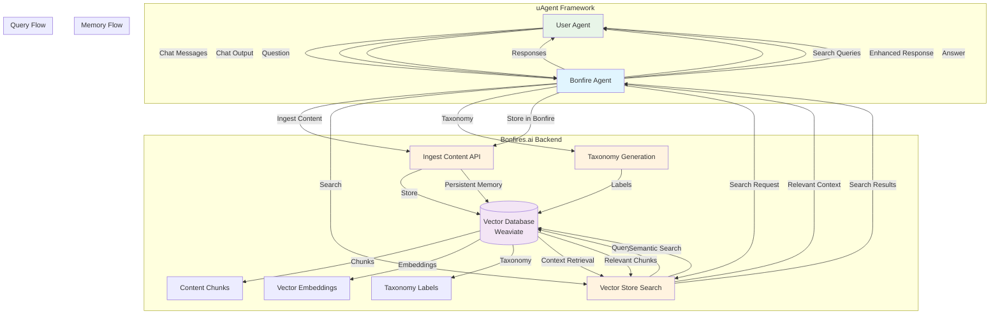

# Architecture Diagram

## System Overview



## Data Flow Architecture

### 1. Memory Storage Flow
```
User Agent → Bonfire Agent → Ingest Content → Vector Database
     ↑                                           ↓
     ← Enhanced Response ← Context Retrieval ← Search
```

### 2. Query Processing Flow
```
User Question → Bonfire Agent → Vector Search → Relevant Context → Response
```

### 3. Taxonomy Generation Flow
```
Content Ingestion → Taxonomy Trigger → Label Generation → Vector Store Update
```

## Integration Components

### uAgent Framework
- **User Agent**: Client application or chat interface
- **Bonfire Agent**: Main integration agent handling communication
- **Protocol**: Standardized chat protocol for message exchange

### Bonfires.ai Backend
- **Ingest Content API**: Stores messages and documents
- **Vector Store Search**: Semantic search capabilities
- **Taxonomy Generation**: Automatic content categorization
- **Vector Database**: Persistent storage with embeddings

### Key Features
- **Persistent Memory**: All conversations stored in bonfires
- **Context Retrieval**: Semantic search for relevant information
- **Taxonomy Learning**: Automatic content organization
- **Real-time Processing**: Immediate response with context 
